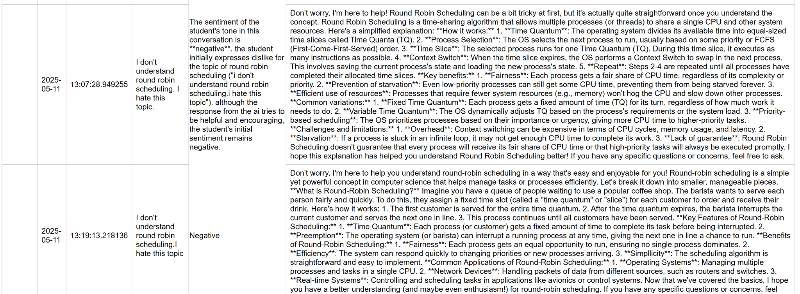

<h1 align="center">Hi, I’m Ayesha 👋</h1>
<p align="center">
Senior CS @ UT Tyler • AI/ML • FastAPI • RAG • PostgreSQL (pgvector) • Voice Agents
</p>

---

### About Me
I build AI systems that actually ship. My flagship project is the **Virtual Teaching Assistant (VTA)** for UT Tyler, deployed on the UT System’s private cloud. It runs directly on professors’ notes with guardrails to ensure secure, accurate answers and includes dashboards for faculty to understand student trends. I also built the **Noodle Agent** during my internship at Noodle Seed,an agent that remembers context, supports voice interactions, summarizes conversations, and connects users to humans when needed.

- Email: **ayeshaa.khalid89@gmail.com**
- LinkedIn: **https://linkedin.com/in/ayesha-khalid-4abb97234**

---

## 🚀 Featured Projects

### 1) Virtual Teaching Assistant (VTA)
Built for The University of Texas at Tyler; deployed on the UT System’s private cloud.

- **What it does:**  
  - Answers using professors’ source notes (guardrails prevent drift).  
  - **Students:** Acts as a teaching assistant.  
  - **Faculty:** Reveals where students struggle and trends across classes.  
  - **Pilot study:** Launching soon.  
- **My role:** Developed from the ground up (architecture, retrieval pipeline, dashboards).

**Tech:** FastAPI • React • PostgreSQL + pgvector • **RAG (Retrieval-Augmented Generation)** • Docker • NGINX


**First image shows the Student-side interface of the Virtual Teaching Assistant (VTA); second image shows the Faculty Dashboard**

<!-- Student and Faculty UI -->


<!-- Sentiment analysis workflow -->

**The next two images, captured during the development phase, demonstrate testing of a sentiment analysis workflow: initially classifying each student query (positive/negative/neutral), later redesigned to comply with FERPA by aggregating sentiment at the topic level rather than per student**





<!-- Use one of these (keep GIF or MP4, remove whichever you don't need) -->


### 🎥 Virtual Teaching Assistant – Demo Videos

Here’s a quick look at how the **Virtual Teaching Assistant (VTA)** works in action.  
Each demo highlights a different part of the system:

- **[Demo 1 – Faculty Dashboard Overview](https://drive.google.com/file/d/19M3QBpgm-hR2OjApbll_TDeMHFD4KeKy/view?usp=sharing)**  
  Walkthrough of the faculty dashboard, showing how instructors upload course materials and view student analytics.

- **[Demo 2 – Student Experience + RAG Responses](https://drive.google.com/file/d/1idO392TR57FObSHaLEqZ9JX0OFVyAMq5/view?usp=sharing)**  
  Demonstration of the student chatbot. See responses with and without RAG, watch how the “with RAG” answers come from the professor’s uploaded PDF, and how students can flag messages.

- **[Demo 3 – Faculty View of Flagged Messages](https://drive.google.com/file/d/1flCoOL-c6GNQLdxVcL8nYEW_YuFQIVx2/view?usp=sharing)**  
  Shows how faculty can review and address flagged student messages for quality assurance.

---
**Key snippet (Python)**
*This function powers semantic search by retrieving the top-k most relevant text chunks from PostgreSQL with pgvector cosine similarity (core to my RAG pipeline in the VTA project).*

```python
# Simplified retrieval: pgvector cosine similarity
def retrieve(conn, q_embed, k=5):
    rows = conn.execute(
        """
        SELECT chunk, 1 - (embedding <=> :q) AS score
        FROM documents
        ORDER BY embedding <=> :q
        LIMIT :k
        """,
        {"q": q_embed, "k": k},
    ).fetchall()
    return [dict(r) for r in rows]
```

---


### 2) Noodle Agent (Noodle Seed)
Built during my internship with Noodle Seed.  
Currently deployed on Fly.dev, and will later be integrated into the company’s new website.  

**What it does:**  
- Human-like conversations with **context memory** across sessions  
- **Voice-to-text** and **text-to-voice** support  
- Summarizes conversations and can route users to a human  
- **My role:** Agent behaviors, voice loop, context management, deployment  

**Tech:** Next.js • Supabase • Voice Agents • WebSocket  

### 🗨️ Noodle Agent – Chat & Voice Demo  

This demo shows how the **Noodle Agent** behaves as both a text and voice-based assistant.  
You will see:  
- How the chat interface handles conversation context.  
- How the voice agent seamlessly picks up **exactly where you left off** in the chat.  
- A smooth back-and-forth between voice and text modes plus all other features

👉 **[Watch the full demo here](https://drive.google.com/file/d/1sNWOdkUAWuPCqSBASFrmoXTMQg6c7_OE/view?usp=sharing)**  


## 🎙 Voice Audio Capture and Streaming Architecture

The Noodle Agent runs a **true voice loop** with OpenAI’s Realtime API over WebRTC: mic → STT → token LLM → incremental TTS, using ephemeral keys and codec tuning.  
*(Excerpted for portfolio — API keys, prompts, and private endpoints redacted.)*

---

### 1. Voice Session Initialization

```typescript
// Excerpted for portfolio — keys & prompts redacted
// useVoiceAgent.ts - Starting a voice session
const startVoiceSession = useCallback(async (sessionId?: string) => {
  if (!audioElementRef.current) {
    audioElementRef.current = new Audio();
    audioElementRef.current.autoplay = true;
  }

  await session.connect({
    getEphemeralKey: () => getEphemeralKey(sessionId),
    audioElement: audioElementRef.current,
    extraContext: {
      userInfo: 'General user interested in Noodle Seed services',
      sessionId: sessionId
    }
  });
}, [session, getEphemeralKey]);
```
 Starts a secure Realtime voice session using ephemeral keys and routes agent audio for low-latency playback.
 
### 2. WebRTC Audio Streaming Setup

```typescript
// Excerpted for portfolio — keys & prompts redacted
// useRealtimeSession.ts - WebRTC connection with audio capture
sessionRef.current = new RealtimeSession(rootAgent, {
  transport: new OpenAIRealtimeWebRTC({
    audioElement,
    changePeerConnection: async (pc: RTCPeerConnection) => {
      applyCodec(pc); // Apply codec preferences (opus, pcm16, etc.)
      return pc;
    },
  }),
  model: 'gpt-4o-realtime-preview-2025-06-03',
  config: {
    inputAudioFormat: audioFormat,
    outputAudioFormat: audioFormat,
    inputAudioTranscription: {
      model: 'whisper-1',
    },
    turnDetection: {
      type: 'server_vad',
      threshold: 0.5,
      prefix_padding_ms: 300,
      silence_duration_ms: 200,
      create_response: true
    }
  }
});
```
Sets up OpenAI Realtime + WebRTC with codec preferences and server-side VAD; streams mic input and receives agent speech in real time.

### 3. Real-time Audio Event Handling

```typescript
// Excerpted for portfolio — events simplified
// useRealtimeSession.ts - Processing audio chunks and transcripts
function handleTransportEvent(event: any) {
  switch (event.type) {
    case "conversation.item.input_audio_transcription.completed":
      historyHandlers.handleTranscriptionCompleted(event, currentSessionId);
      break;
    case "response.audio_transcript.delta":
      historyHandlers.handleTranscriptionDelta(event);
      updateAgentSpeaking(true);
      break;
    case "response.audio.delta":
      updateAgentSpeaking(true);
      break;
    case "response.audio.done":
      updateAgentSpeaking(false);
      break;
  }
}
```
Handles live events from the voice agent, partial user transcripts, token-streamed agent text, and audio frames to drive responsive UI state.

### 4.Audio Format and Codec Handling

```typescript
// codecUtils.ts - Audio format configuration
// Excerpted for portfolio — shows PCM16/G.711 handling
export function audioFormatForCodec(codec: string): 'pcm16' | 'g711_ulaw' | 'g711_alaw' {
  let audioFormat: 'pcm16' | 'g711_ulaw' | 'g711_alaw' = 'pcm16';
  if (typeof window !== 'undefined') {
    const c = codec.toLowerCase();
    if (c === 'pcmu') audioFormat = 'g711_ulaw';
    else if (c === 'pcma') audioFormat = 'g711_alaw';
  }
  return audioFormat;
}
```
Utility for audio codecs & formats (PCM16 / G.711) to maximize WebRTC compatibility and reduce latency.

### 5.Backend Session Management

```typescript
// /api/voice-session/route.ts - Creating ephemeral keys for WebRTC
// Excerpted for portfolio — API key & instructions redacted
export async function GET(request: Request) {
  const response = await fetch('https://api.openai.com/v1/realtime/sessions', {
    method: 'POST',
    headers: {
      'Authorization': `Bearer ${process.env.OPENAI_API_KEY}`,
      'Content-Type': 'application/json'
    },
    body: JSON.stringify({
      model: 'gpt-4o-realtime-preview-2025-06-03',
      voice: 'alloy',
      instructions: "Agent instructions redacted"
    })
  });

  const data = await response.json();
  return NextResponse.json({
    apiKey: data.client_secret.value,
    sessionId: data.id
  });
}
```
Server endpoint that mints ephemeral Realtime session credentials (no static keys in the client) and applies voice/instruction settings.
 


## 🏆 Achievements — Conferences & Publications


**Conferences & Presentations**

- **Annual Research Showcase, UT Tyler, Tyler, TX, 2025**  
  *VTA: Enhancing Teaching and Learning with Virtual Teaching Assistant*  
  **Authors:** A. Khalid, S. Dakshit, K. Mokhtari

- **UT System AI Symposium in Healthcare, Houston, TX, 2025**  
  *Virtual Teaching Assistants (VTAs): An AI-Driven Framework for Personalized Learning Across Disciplines*  
  **Authors:** A. Khalid, S. Dakshit, K. Mokhtari

- **Texas Advanced Computing Center for Texas Researchers Symposium (TACCSTER), Austin, TX, 2025 (forthcoming)**  
  *Bridging AI and Education: The Virtual Teaching Assistant*  
  **Authors:** A. Khalid, S. Dakshit, K. Mokhtari

**Paper (Accepted)**

Khalid, A., Dakshit, S., & Mokhtari, K. (In Press). *Human-AI Partnerships in Higher Education: Rethinking Teaching and Learning with a Virtual Teaching Assistant*. In A. Adoui and B. Seilstad (Eds.), *Artificial Intelligence, Academic Integrity, and the Internationalization of Higher Education: Navigating Innovation and Ethics*. Springer Publishers.

---

## 🛠 Skills

Python • FastAPI • PostgreSQL/pgvector • Docker • NGINX • React.js • Azure • AWS

### 🔒 Note on Private Work
Most of my professional projects are hosted in private organization repositories and cannot be shared publicly due to confidentiality.  
To give recruiters and collaborators an overview of my skills, I’ve included selected highlights, screenshots, code snippets, and project summaries in this portfolio.

If you’d like to learn more about my work with:

- **Virtual Teaching Assistant (VTA)** — AI-driven education platform deployed on UT System’s private cloud
- **Noodle Agent** — real-time voice-enabled AI assistant deployed at Noodle Seed

I’m happy to discuss the technical details, architecture, and outcomes during interviews or by request.
